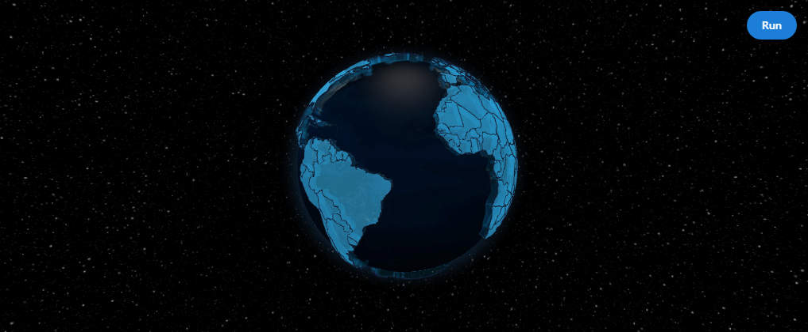
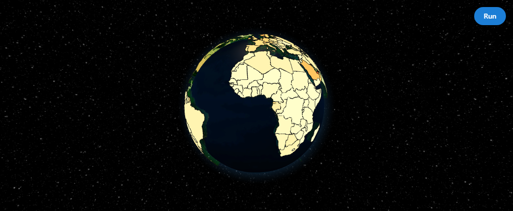
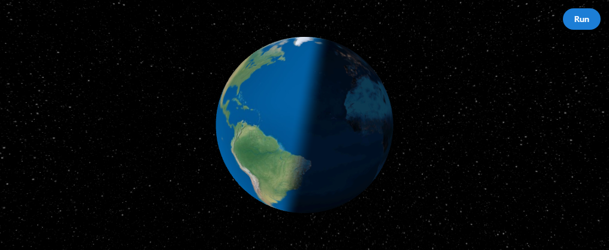
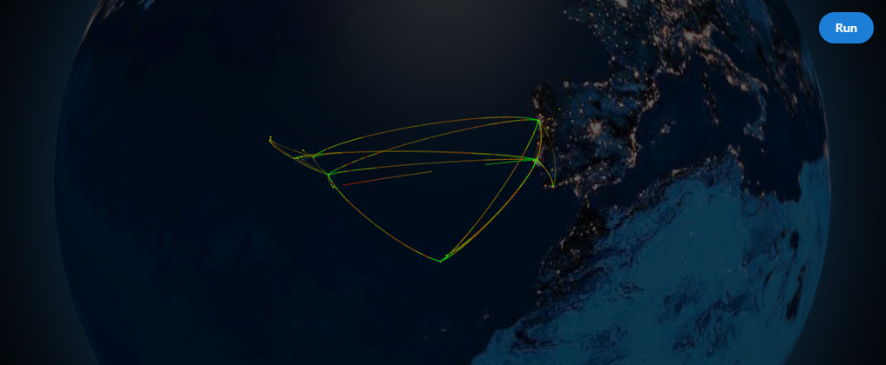

# Dash Globe

[](https://pypi.org/project/dash-globe/)
[](LICENSE)
[](https://jeffgallini.github.io/dash-globe/)

**Interactive 3D globes for Dash** — a figure-like Python wrapper around [`react-globe.gl`](https://github.com/vasturiano/react-globe.gl).



## Highlights

- Chainable helpers: `update_layout`, `update_globe`, `update_view`, `add_points`, `add_arcs`, `add_polygons`, and more
- Full layer coverage: points, arcs, polygons, paths, heatmaps, hex bins, tiles, particles, rings, labels
- Dash-native events: `clickData`, `hoverData`, `rightClickData`, `currentView`, `globeReady`
- Scene effects: day/night cycle, rotating clouds, serializable materials and ring fades
- Large data: `data_url(...)` + `enable_large_data_mode()` keep GeoJSON out of the Dash layout
- Docs gallery: Mantine-styled [`usage.py`](dash_globe/usage.py) plus [GitHub Pages docs](https://jeffgallini.github.io/dash-globe/)

## Install

```bash
pip install dash-globe
```

## Quick Start

```python
from dash import Dash, html
import dash_globe

app = Dash(__name__)

globe = (
    dash_globe.DashGlobe(id="globe")
    .update_layout(height=520, background_color="#020817")
    .update_globe(globe_image_url=dash_globe.PRESETS.EARTH_NIGHT, show_atmosphere=True)
    .update_controls(auto_rotate=True, auto_rotate_speed=0.35)
    .add_points([
        {"name": "New York", "lat": 40.7128, "lng": -74.0060, "color": "#ff6b6b"},
        {"name": "London", "lat": 51.5072, "lng": -0.1276, "color": "#ffd166"},
        {"name": "Tokyo", "lat": 35.6762, "lng": 139.6503, "color": "#4cc9f0"},
    ])
    .update_points(
        point_lat="lat",
        point_lng="lng",
        point_color="color",
        point_label="name",
        point_altitude=0.08,
        point_radius=0.28,
    )
)

app.layout = html.Div(globe)

if __name__ == "__main__":
    app.run(debug=True)
```

## Large Datasets

Fetch GeoJSON in the browser so the Dash layout stays small:

```python
globe = (
    dash_globe.DashGlobe(id="countries")
    .enable_large_data_mode()
    .update_polygons(
        data=dash_globe.data_url(
            "https://raw.githubusercontent.com/vasturiano/react-globe.gl/master/example/datasets/ne_110m_admin_0_countries.geojson"
        ),
        polygon_geo_json_geometry="geometry",
        polygon_cap_color="rgba(56, 189, 248, 0.55)",
        polygon_altitude=0.06,
        polygon_label="properties.ADMIN",
    )
)
```

## Examples

| Example | Preview |
| --- | --- |
| Large dataset via `data_url` |  |
| Choropleth countries |  |
| Day / night cycle |  |
| Airline routes |  |

More screenshots and short loops: [Examples on GitHub Pages](https://jeffgallini.github.io/dash-globe/examples.html).

### Run the interactive gallery locally

```bash
cd dash_globe
python usage.py
```

Open `http://127.0.0.1:8050`.

Opt into Dash debug mode:

```bash
# bash
DASH_GLOBE_DEBUG=1 python usage.py
```

```powershell
# PowerShell
$env:DASH_GLOBE_DEBUG="1"
python usage.py
```

## Documentation

- **Hosted docs:** https://jeffgallini.github.io/dash-globe/
- **Getting started:** https://jeffgallini.github.io/dash-globe/getting-started.html
- **Live gallery source:** [`dash_globe/usage.py`](dash_globe/usage.py)
- **Changelog:** [`CHANGELOG.md`](CHANGELOG.md)

## Development

```bash
cd dash_globe
npm install
npm run build:js
npm run build:backends
python usage.py
```

Regenerate docs screenshots/GIFs from a running gallery:

```bash
python script/capture_docs_media.py
```

Release versioning:

```bash
python script/release_version.py current
python script/release_version.py set 1.0.0
```

Pushing to `master` with a commit message containing `v1.0.0` (or relying on the publish workflow) tags and publishes the package.

## Notes

- The wrapper focuses on JSON-serialisable `react-globe.gl` features that map cleanly to Dash callbacks.
- Prefer `data_url(...)` plus `enable_large_data_mode()` for country-scale GeoJSON.
- Three.js / H3 load as separately cached async chunks so the DashGlobe bundle stays small.
- CSS color constants like `rgba(...)` are wrapped into real accessors so they render correctly with upstream `accessor-fn`.

## License

MIT
